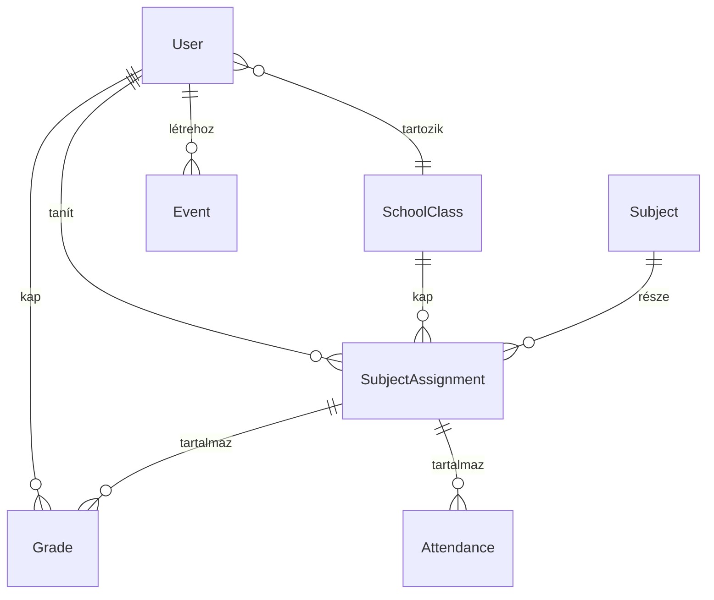

# Padtárs

**Padtárs** — a digitális iskolatársad. Középiskolai oktatásszervezési portál fullstack megvalósítása a **Modern Fullstack és Mobil Fejlesztői Verseny 2026** keretében.

## 🚀 Élő demo

- 🌐 **Web:** https://oktatas-portal.vercel.app
- 📦 **GitHub:** https://github.com/c9n6zk/oktatas-portal
- 📱 **Mobil:** Expo Go-val a `pnpm --filter @repo/mobile dev` futása után QR-rel

## 👤 Demo fiókok

Az alábbi 4 fiókkal mind a 4 szerepkör kipróbálható. Jelszó: `password`.

| Email | Szerepkör | Példa funkció |
|---|---|---|
| `superadmin@demo.hu` | Szuper-admin (Szuper Admin) | Adminok kezelése, minden funkció |
| `admin@demo.hu` | Adminisztrátor (Admin Anna) | Felhasználók, osztályok, tárgyak, hozzárendelések, események |
| `instructor@demo.hu` | Oktató (Oktató Géza) | Jegybeírás, osztálystatisztika |
| `student@demo.hu` | Diák (Diák Béla, 2024/A) | Saját jegyek súlyozott átlaggal |

## 🎯 Funkciók

### Kötelező követelmények (a feladatkiírás szerint)

| Funkció | Megvalósítás |
|---|---|
| **4-szintű szerepkörrendszer** | Diák / Oktató / Adminisztrátor / Szuper-adminisztrátor hierarchikus modellel |
| **Bejelentkezés** | NextAuth v5 (credentials), bcrypt-elt jelszó, JWT mobil kliensnek |
| **Adminisztrátori funkciók** | Diák/Oktató fiók CRUD, Tárgy létrehozás, Osztályhoz rendelés (évenkénti) |
| **Oktatói funkciók** | Saját tárgyhozzárendelések kezelése, jegyek beírása (5 típus, súlyokkal) |
| **Diák nézet** | Saját jegyek tantárgyanként, súlyozott átlag, év végi javasolt jegy |
| **Osztály modell** | `startYear + identifier` (pl. 2024/A) |
| **Tárgy modell** | leírás + tankönyv + leckék listája |
| **Tárgy-Osztály-Oktató évenkénti hozzárendelés** | Külön `SubjectAssignment` entitás (`year` + `subjectId` + `classId` + `teacherId`) |
| **Év végi jegy** | Külön `GradeType.YEAR_END` enum érték |

### Opcionális/innovatív feladatok

| Funkció | Megvalósítás |
|---|---|
| **Súlyozott átlag** | Felelés 1×, Témazáró 3× (default), egyedi súly is megadható. Számítás a `@repo/shared/grading` modulban |
| **Statisztikák oktatónak** | Osztály × tárgy súlyozott átlag, diákszám, jegyszám |
| **Féléves + Év végi jegy** | Különálló típusok (`MID_YEAR`, `YEAR_END`), év végi automata javaslat |
| **Iskolai események** | Admin létrehozza, Diák+Oktató látja (cím, hely, kezdés/vég) |
| **🌗 Sötét / világos mód** | `next-themes` integrációval, rendszer-szintű detektálás |
| **📱 Reszponzív web + natív mobil** | Tailwind reszponzív + Expo natív kliens |
| **📍 GPS-alapú jelenléti rendszer** | Mobilon "Itt vagyok" gomb → `expo-location` → lat/lng + assignment ID elküldése a backendnek |
| **📷 Kamera + 🔔 Push értesítés** | Natív demo komponensek (`expo-camera`, `expo-notifications`) |

## 🏗️ Tech stack

- **Monorepo:** pnpm workspaces + Turborepo
- **Backend + Frontend:** Next.js 15 (App Router) + TypeScript
- **Adatbázis:** PostgreSQL (lokál: Docker, prod: Supabase managed)
- **ORM:** Prisma (schema-first, megosztott `@repo/db`)
- **Auth:** NextAuth v5 (Credentials) + JWT (Bearer, mobil)
- **UI:** Tailwind CSS + shadcn/ui (Radix primitives) + lucide-react ikonok
- **Validáció:** Zod (megosztott `@repo/shared`)
- **Mobil:** Expo SDK 52 + expo-router (tab navigátor)
- **Deploy:** Vercel (auto-deploy GitHub main push-ra) + Supabase managed PostgreSQL

## 🗂️ Architektúra

```
apps/
  web/                      Next.js 15 — frontend + REST API
    src/app/(authed)/       Védett oldalak (Server Component layout)
      student/grades/       Diák: saját jegyek + súlyozott átlag
      instructor/grading/   Oktató: jegybeírás osztály-bontásban
      admin/users/          Admin: felhasználók
      admin/classes/        Admin: osztályok
      admin/subjects/       Admin: tárgyak
      admin/assignments/    Admin: tárgy-osztály-oktató hozzárendelések
      events/               Iskolai események
    src/app/api/            REST endpoint-ok (NextAuth + domain + mobil)
      classes /subjects /assignments /grades /events /admin/users
      mobile/ login,me,grades,attendance
    src/lib/                auth.ts (full), auth.config.ts (Edge), rbac, mobile-auth
    src/components/         AppShell + shadcn UI
  mobile/                   Expo + expo-router
    app/(auth)/login        Bejelentkezés
    app/(app)/dashboard     Áttekintés (jegy statisztika)
    app/(app)/grades        Saját jegyek + tantárgyi átlagok
    app/(app)/attendance    GPS-alapú jelenléti
    app/(app)/native        Natív demók (kamera/GPS/push)
    app/(app)/profile       Profil + kilépés
    src/api/                API client + SecureStore token
    src/auth/               AuthProvider

packages/
  db/                       Prisma schema + client + seed
    prisma/schema.prisma    7 modell + 2 enum
    prisma/seed.ts          4 user, 2 osztály, 4 tárgy, 6 assignment, 10 jegy
  shared/                   Zod schémák + grading helper
    src/domain.ts           SchoolClass, Subject, Assignment, Grade, Event Zod schémák
    src/grading.ts          calculateWeightedAverage, suggestedYearEndGrade
    src/roles.ts            Role hierarchy + hasRole helper
```

## 🔌 REST API

Mind védve (`requireAuth` / `requireRole` / `requireAnyRole` middleware-ekkel).

| Endpoint | Method | Role | Funkció |
|---|---|---|---|
| `/api/classes` | GET / POST | bárki / ADMIN+ | Osztály lista / létrehozás |
| `/api/classes/[id]` | DELETE | ADMIN+ | Osztály törlés |
| `/api/subjects` | GET / POST | bárki / ADMIN+ | Tárgy lista / létrehozás |
| `/api/subjects/[id]` | PATCH / DELETE | ADMIN+ | Tárgy módosítás / törlés |
| `/api/assignments` | GET / POST | bárki / ADMIN+ | Hozzárendelés (year/teacherId/classId filter) |
| `/api/assignments/[id]` | DELETE | ADMIN+ | Hozzárendelés törlés |
| `/api/grades` | GET / POST | role-szerint scope-olt / INSTRUCTOR+ | Jegyek lekérése / beírás |
| `/api/grades/[id]` | DELETE | INSTRUCTOR (saját) + ADMIN+ | Jegy törlés |
| `/api/events` | GET / POST | auth / ADMIN+ | Esemény lista / létrehozás |
| `/api/events/[id]` | DELETE | ADMIN+ | Esemény törlés |
| `/api/admin/users` | GET / POST | ADMIN+ | Felhasználó lista / létrehozás |
| `/api/admin/users/[id]` | PATCH / DELETE | ADMIN+ / SUPERADMIN promotion-höz | Role-változtatás / törlés |
| `/api/register` | POST | public | Új diák regisztráció |
| `/api/auth/[...nextauth]` | GET / POST | public | NextAuth session |
| `/api/mobile/login` | POST | public | JWT issue (Bearer) |
| `/api/mobile/me` | GET | Bearer | Aktuális user |
| `/api/mobile/grades` | GET | Bearer (STUDENT) | Saját jegyek súlyozott átlaggal |
| `/api/mobile/attendance` | GET / POST | Bearer (STUDENT) | Tárgylista / GPS check-in |

## 🚀 Gyors indítás (lokális)

### Előfeltételek
- Node.js ≥ 20
- pnpm ≥ 9
- Docker Desktop (a Postgres-hez)

### Lépések

```bash
# 1. Függőségek
pnpm install

# 2. Postgres indítása Docker-rel (port 5433)
docker compose up -d

# 3. Env (alapból mindenre konfigurálva)
cp .env.example .env

# 4. Adatbázis init + seed (4 demo user, 2 osztály, 4 tárgy, 10 jegy)
pnpm db:push
pnpm db:seed

# 5. Web indítás
pnpm dev
# → http://localhost:3000

# 6. Mobil indítás (másik terminálban)
cd apps/mobile
pnpm dev
# → QR kód: Expo Go app-pal beolvasod telefonon
```

A telepítési útmutató részletesen a [DEPLOY.md](./DEPLOY.md) fájlban (Vercel + Supabase cloud setup is).

## 🧪 Smoke teszt curl-lel

```bash
# Mobil login
TOKEN=$(curl -s -X POST http://localhost:3000/api/mobile/login \
  -H "content-type: application/json" \
  -d '{"email":"student@demo.hu","password":"password"}' | jq -r .token)

# Jegyek tantárgyanként
curl -H "authorization: Bearer $TOKEN" http://localhost:3000/api/mobile/grades | jq .
```

## 📐 Adatmodell



## 📄 Licenc

A verseny céljaira készült demonstrációs projekt.
