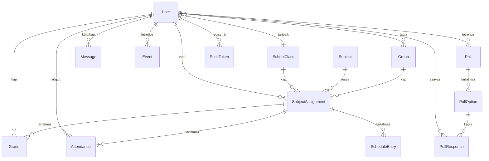

# Padtárs

**Padtárs** — a digitális iskolatársad. Középiskolai oktatásszervezési portál fullstack megvalósítása a **Modern Fullstack és Mobil Fejlesztői Verseny 2026** keretében.

## 🚀 Élő demo

- 🌐 **Web:** https://oktatas-portal.vercel.app
- 📦 **GitHub:** https://github.com/c9n6zk/oktatas-portal
- 📱 **Mobil:** Expo Go-val a `pnpm --filter @repo/mobile dev` futása után QR-rel

## 👤 Demo fiókok

Az alábbi 4 fiókkal mind a 4 szerepkör kipróbálható. Jelszó: `password`.

| Email | Szerepkör | Példa funkció |
|---|---|---|
| `superadmin@demo.hu` | Szuper-admin (Szuper Admin) | Adminok kezelése, minden funkció |
| `admin@demo.hu` | Adminisztrátor (Admin Anna) | Felhasználók, osztályok, tárgyak, hozzárendelések, események |
| `instructor@demo.hu` | Oktató (Oktató Géza) | Jegybeírás, osztálystatisztika |
| `student@demo.hu` | Diák (Diák Béla, 2024/A) | Saját jegyek súlyozott átlaggal |

## 🎯 Funkciók

### Kötelező követelmények (a feladatkiírás szerint)

| Funkció | Megvalósítás |
|---|---|
| **4-szintű szerepkörrendszer** | Diák / Oktató / Adminisztrátor / Szuper-adminisztrátor hierarchikus modellel |
| **Bejelentkezés** | NextAuth v5 (credentials), bcrypt-elt jelszó, JWT mobil kliensnek |
| **Adminisztrátori funkciók** | Diák/Oktató fiók CRUD, Tárgy létrehozás, Osztályhoz rendelés (évenkénti) |
| **Oktatói funkciók** | Saját tárgyhozzárendelések kezelése, jegyek beírása (5 típus, súlyokkal) |
| **Diák nézet** | Saját jegyek tantárgyanként, súlyozott átlag, év végi javasolt jegy |
| **Osztály modell** | `startYear + identifier` (pl. 2024/A) |
| **Tárgy modell** | leírás + tankönyv + leckék listája |
| **Tárgy-Osztály-Oktató évenkénti hozzárendelés** | Külön `SubjectAssignment` entitás (`year` + `subjectId` + `classId` + `teacherId`) |
| **Év végi jegy** | Külön `GradeType.YEAR_END` enum érték |

### Opcionális/innovatív feladatok

| Funkció | Megvalósítás |
|---|---|
| **Súlyozott átlag** | Felelés 1×, Témazáró 3× (default), egyedi súly is megadható. Számítás a `@repo/shared/grading` modulban |
| **Statisztikák oktatónak** | Osztály × tárgy súlyozott átlag, diákszám, jegyszám |
| **Féléves + Év végi jegy** | Különálló típusok (`MID_YEAR`, `YEAR_END`), év végi automata javaslat |
| **Iskolai események** | Admin létrehozza, Diák+Oktató látja (cím, hely, kezdés/vég) |
| **💬 Üzenetküldés** (Diák↔Oktató kétirányú) | Kontaktlista + thread nézet (`/messages`), olvasatlan badge, automata "olvasottra állítás", RBAC: diák csak az osztályát/csoportját tanító oktatókkal, oktató csak a saját diákjaival |
| **🗳️ Szavazás / kérdőív** | Admin létrehozza, célközönség szűkíthető (`ALL` / `STUDENTS` / `INSTRUCTORS` / `CLASS`), élő eredmény (`/polls`) |
| **🗓️ Órarend** + helyettesítő tanár | Heti óra (nap, kezdés-vég, terem) `SubjectAssignment`-hez kötve; oktatónként helyettesítő bejelölhető (`/timetable`, `/admin/schedule`) |
| **👥 Csoportok** (osztály-független) | `Group` modell, tetszőleges diák-halmaz, `SubjectAssignment` `groupId`-vel — pl. nyelvi csoport, haladó matek (`/admin/groups`) |
| **♿ Accessibility** — világos / sötét / **magas kontraszt** | `next-themes` + 3. téma WCAG AAA ~21:1 fekete/sárga kontraszttal, vastag keretek, aláhúzott linkek, erős focus outline |
| **📱 Reszponzív web** | Tailwind breakpoint-ok, mobil hamburger nav, mobil-első üzenőfal (`100dvh` dynamic viewport) |
| **📍 GPS-alapú jelenléti rendszer** *(innováció)* | Mobilon "Itt vagyok" gomb → `expo-location` → lat/lng + assignment ID elküldése a backendnek (`Attendance.source="gps"`) |
| **📷 Kamera** | Natív demo komponens (`expo-camera`) |
| **🔔 Push értesítés (end-to-end)** | Mobil app login után regisztrálja az Expo push tokent (`/api/mobile/push-token`). Jegybeíráskor a szerver értesítést küld a diák eszközére (`PushToken` modell + Expo push REST API). |

## 🏗️ Tech stack

- **Monorepo:** pnpm workspaces + Turborepo
- **Backend + Frontend:** Next.js 15 (App Router) + TypeScript
- **Adatbázis:** PostgreSQL (lokál: Docker, prod: Supabase managed)
- **ORM:** Prisma (schema-first, megosztott `@repo/db`)
- **Auth:** NextAuth v5 (Credentials) + JWT (Bearer, mobil)
- **UI:** Tailwind CSS + shadcn/ui (Radix primitives) + lucide-react ikonok
- **Validáció:** Zod (megosztott `@repo/shared`)
- **Mobil:** Expo SDK 52 + expo-router (tab navigátor)
- **Deploy:** Vercel (auto-deploy GitHub main push-ra) + Supabase managed PostgreSQL

## 🗂️ Architektúra

```
apps/
  web/                      Next.js 15 — frontend + REST API
    src/app/(authed)/       Védett oldalak (Server Component layout)
      student/grades/       Diák: saját jegyek + súlyozott átlag
      instructor/grading/   Oktató: jegybeírás osztály-bontásban + statisztika
      admin/users/          Admin: felhasználók
      admin/classes/        Admin: osztályok
      admin/subjects/       Admin: tárgyak
      admin/assignments/    Admin: tárgy-osztály-oktató hozzárendelések
      admin/groups/         Admin: csoportok (osztály-független)
      admin/schedule/       Admin: heti órarend + helyettesítő tanár
      timetable/            Diák/Oktató: heti órarend nézet
      messages/             Diák↔Oktató kétirányú üzenetváltás
      polls/                Szavazás / kérdőív
      events/               Iskolai események
      profile/              Saját profil
    src/app/api/            REST endpoint-ok (NextAuth + domain + mobil)
      classes /subjects /assignments /grades /events /admin/users
      messages /polls /groups /schedule
      mobile/ login,me,grades,attendance,push-token
    src/app/                error.tsx, global-error.tsx, not-found.tsx
    src/lib/                auth.ts (full), auth.config.ts (Edge), rbac, mobile-auth, messaging
    src/components/         AppShell + DesktopSidebar + MobileNav + ThemeToggle + shadcn UI
  mobile/                   Expo + expo-router
    app/(auth)/login        Bejelentkezés
    app/(app)/dashboard     Áttekintés (jegy statisztika)
    app/(app)/grades        Saját jegyek + tantárgyi átlagok
    app/(app)/attendance    GPS-alapú jelenléti
    app/(app)/native        Natív demók (kamera/GPS/push)
    app/(app)/profile       Profil + kilépés
    src/api/                API client + SecureStore token
    src/auth/               AuthProvider
    src/push/               Expo push token regisztráció

packages/
  db/                       Prisma schema + client + seed
    prisma/schema.prisma    14 modell + 4 enum
    prisma/seed.ts          4 user, 2 osztály, 4 tárgy, 6 assignment, 10 jegy,
                            3 esemény, 2 csoport, 6 órarend bejegyzés,
                            1 kérdőív (4 opció), 3 demo üzenet
  shared/                   Zod schémák + grading helper
    src/domain.ts           SchoolClass, Subject, Assignment, Grade, Event Zod schémák
    src/grading.ts          calculateWeightedAverage, suggestedYearEndGrade
    src/roles.ts            Role hierarchy + hasRole helper
```

## 🔌 REST API

Mind védve (`requireAuth` / `requireRole` / `requireAnyRole` middleware-ekkel).

| Endpoint | Method | Role | Funkció |
|---|---|---|---|
| `/api/classes` | GET / POST | bárki / ADMIN+ | Osztály lista / létrehozás |
| `/api/classes/[id]` | DELETE | ADMIN+ | Osztály törlés |
| `/api/subjects` | GET / POST | bárki / ADMIN+ | Tárgy lista / létrehozás |
| `/api/subjects/[id]` | PATCH / DELETE | ADMIN+ | Tárgy módosítás / törlés |
| `/api/assignments` | GET / POST | bárki / ADMIN+ | Hozzárendelés (year/teacherId/classId filter) |
| `/api/assignments/[id]` | DELETE | ADMIN+ | Hozzárendelés törlés |
| `/api/grades` | GET / POST | role-szerint scope-olt / INSTRUCTOR+ | Jegyek lekérése / beírás |
| `/api/grades/[id]` | DELETE | INSTRUCTOR (saját) + ADMIN+ | Jegy törlés |
| `/api/events` | GET / POST | auth / ADMIN+ | Esemény lista / létrehozás |
| `/api/events/[id]` | DELETE | ADMIN+ | Esemény törlés |
| `/api/messages` | GET / POST | auth | Beszélgetések listája / új üzenet (jogosultság ellenőrzéssel) |
| `/api/messages/[userId]` | GET | auth | Thread + automata olvasottra állítás |
| `/api/polls` | GET / POST | auth / ADMIN+ | Szavazás lista (célközönség-szűrve) / létrehozás |
| `/api/polls/[id]` | POST / DELETE | auth / ADMIN+ | Szavazat leadás / szavazás törlés |
| `/api/groups` | GET / POST | auth / ADMIN+ | Csoport lista / létrehozás |
| `/api/groups/[id]` | PATCH / DELETE | ADMIN+ | Tagok módosítása / törlés |
| `/api/schedule` | GET / POST | auth / ADMIN+ | Heti órarend / új óra (terem, idő) |
| `/api/schedule/[id]` | PATCH / DELETE | ADMIN+ | Helyettesítő tanár / törlés |
| `/api/admin/users` | GET / POST | ADMIN+ | Felhasználó lista / létrehozás |
| `/api/admin/users/[id]` | PATCH / DELETE | ADMIN+ / SUPERADMIN promotion-höz | Role-változtatás / törlés |
| `/api/register` | POST | public | Új diák regisztráció |
| `/api/auth/[...nextauth]` | GET / POST | public | NextAuth session |
| `/api/mobile/login` | POST | public | JWT issue (Bearer) |
| `/api/mobile/me` | GET | Bearer | Aktuális user |
| `/api/mobile/grades` | GET | Bearer (STUDENT) | Saját jegyek súlyozott átlaggal |
| `/api/mobile/attendance` | GET / POST | Bearer (STUDENT) | Tárgylista / GPS check-in |
| `/api/mobile/push-token` | POST / DELETE | Bearer | Expo push token regisztráció / törlés (új jegy értesítéshez) |

## 🚀 Gyors indítás (lokális)

### Előfeltételek
- Node.js ≥ 20
- pnpm ≥ 9
- Docker Desktop (a Postgres-hez)

### Lépések (cca. 2 perc)

```bash
# 1. Függőségek (~30 mp első alkalommal)
pnpm install

# 2. Postgres indítása Docker-rel (port 5433-on, hogy ne ütközzön rendszerszintűvel)
docker compose up -d

# 3. .env létrehozása az .env.example-ből
cp .env.example .env            # Linux / macOS / Git Bash
# Windows PowerShell:
# Copy-Item .env.example .env

# 4. Adatbázis séma + seed (4 demo user, 2 osztály, 4 tárgy, 10 jegy,
#    3 esemény, 2 csoport, 6 órarend bejegyzés, 1 kérdőív, 3 üzenet)
pnpm db:push
pnpm db:seed

# 5. Web indítás
pnpm dev
# → http://localhost:3000  (Login: student@demo.hu / password)

# 6. Mobil indítás (külön terminál, opcionális)
cd apps/mobile && pnpm dev
# → QR kód: Expo Go app-pal beolvasod telefonon
```

A felhő-üzemeltetéshez (Vercel + Supabase) lásd a [DEPLOY.md](./DEPLOY.md) fájlt.

### Tipikus problémák és megoldásuk

| Tünet | Megoldás |
|---|---|
| `Port 5433 is already in use` | A `docker-compose.yml`-ben átírható a portmap (`5433:5432` → `5434:5432`), majd a `.env`-ben `localhost:5433` → `localhost:5434`. |
| `Port 3000 is in use, using available port 3001` | Egy másik dev szerver fut. Vagy fogadd el a 3001-et, vagy `npx kill-port 3000`. |
| Prisma `EPERM: operation not permitted` Windowson `db:push` után | A futó Next.js dev szerver fogja a Prisma engine .dll-t. `npx kill-port 3000` majd `pnpm --filter @repo/db generate`. |
| Vercel deploy `Cannot find module .prisma/client` | A monorepo build során a Prisma client copy lépés kell — lásd `apps/web/vercel.json` és `apps/web/next.config.mjs` (`outputFileTracingIncludes`). |
| Mobil app nem éri el a backendet | `apps/mobile/.env`-ben az `EXPO_PUBLIC_API_URL` legyen a PC LAN IP-je (pl. `http://192.168.x.x:3000`), **ne** `localhost` — a telefonon az `localhost` saját magát jelenti. Android emulátor: `http://10.0.2.2:3000`. |
| `AUTH_SECRET` hiba | A `.env`-ben legyen min. 32 karakteres. `openssl rand -base64 32` adja a megfelelő értéket. |

## 📱 Mobil app tesztelése

### A) Expo Go fizikai telefonon (ajánlott — natív funkciók is működnek)

1. Telepítsd a **Expo Go** appot: [Play Store](https://play.google.com/store/apps/details?id=host.exp.exponent) / [App Store](https://apps.apple.com/app/expo-go/id982107779).
2. Backend megválasztása — a mobil `apps/mobile/.env`-ben állítható:
   ```bash
   # Vercel production backend (legegyszerűbb, semmit nem kell helyben futtatni)
   EXPO_PUBLIC_API_URL="https://oktatas-portal.vercel.app"

   # VAGY: helyi backend ugyanazon WiFi-n (PC IP-d, nem localhost!)
   EXPO_PUBLIC_API_URL="http://192.168.x.x:3000"
   ```
3. `cd apps/mobile && pnpm dev` → terminálban QR kód megjelenik.
4. **Android**: nyisd meg Expo Go-t → "Scan QR code" → szkenneld a kódot.  
   **iOS**: nyisd meg a beépített Camera appot → szkennelj rá → "Open in Expo Go".
5. Login képernyő — érintsd meg pl. a **Diák Béla** dev gombot egy klikkes belépéshez.

### B) Web preview böngészőben (gyors UI-check, natív funkciók nélkül)

```bash
cd apps/mobile
pnpm web
# → http://localhost:8081 — UI átnézhető, de GPS/kamera/push nem megy
```

### C) Android emulátor / iOS simulator

`pnpm dev` után az Expo terminálban nyomj `a` (Android) vagy `i` (iOS) billentyűt. Android emulátoron a host backend `10.0.2.2:3000`-on érhető el.

### Natív funkciók kipróbálása

- **📍 GPS jelenléti**: belépés diákként → `Jelenléti` tab → engedélyezd a helymeghatározást → `Itt vagyok` gomb. Backend `/api/mobile/attendance` POST-ot kap GPS koordinátákkal és tárolja az `Attendance` táblába.
- **📷 Kamera**: `Natív` tab → `Fotó készítése` — engedélyezd a kamerát, készíts képet.
- **🔔 Push értesítés**: `Natív` tab → `Push token regisztráció` (csak fizikai eszközön; emulátoron nem). Helyi értesítés `Helyi értesítés` gombbal.

### Saját buildelt APK (opcionális, EAS Build)

A versenybírálathoz Expo Go-val is teljesen tesztelhető a kliens, de saját telepíthető APK is buildelhető:

```bash
pnpm dlx eas-cli login
pnpm dlx eas-cli build --platform android --profile preview
# → kb. 10 perc felhő-build, végén letölthető .apk link
```

## 🧪 Smoke teszt curl-lel

```bash
# Mobil login
TOKEN=$(curl -s -X POST http://localhost:3000/api/mobile/login \
  -H "content-type: application/json" \
  -d '{"email":"student@demo.hu","password":"password"}' | jq -r .token)

# Jegyek tantárgyanként
curl -H "authorization: Bearer $TOKEN" http://localhost:3000/api/mobile/grades | jq .
```

## 📐 Adatmodell



**Modellek (14):** `User`, `SchoolClass`, `Group`, `Subject`, `SubjectAssignment`, `ScheduleEntry`, `Grade`, `Attendance`, `Event`, `Message`, `Poll`, `PollOption`, `PollResponse`, `PushToken` *(+ NextAuth: Account, Session, VerificationToken)*.

## 📄 Licenc

A verseny céljaira készült demonstrációs projekt.
